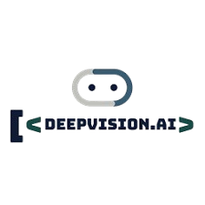
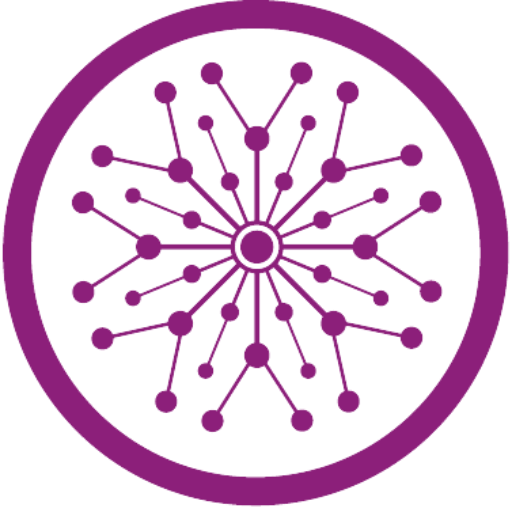
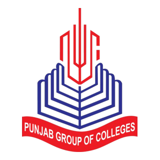

<div align="center">

# Muhammad Umer Iqbal

### AI Engineer & Full-Stack Developer


<br>
<p>
  
  
  
</p>

---

| ⚡ AI Systems | 🖥️ Full-Stack Dev | 🇵🇰 Pakistan | 🌍 Remote Ready |
|:---:|:---:|:---:|:---:|
| **Production-Grade AI** | **Next.js · FastAPI · Laravel** | **Faisalabad** | **Open to Work** |

</div>

---

## About Me

```json
{
  "name":      "Muhammad Umer Iqbal",
  "role":      "AI Engineer & Full-Stack Developer",
  "location":  "Lahore, Pakistan",
  "education": "BS Gaming & Multimedia (Computer Software Engineering) - Superior University",
  "focus": [
    "Production-grade Computer Vision systems",
    "RAG Chatbots & Generative AI Pipelines",
    "AI Voice Calling Agents",
    "Full-Stack Web & ERP Platforms"
  ],
  "contact":   "umer.mhtecnologies@gmail.com"
}
```

I build end-to-end AI and web systems — from real-time CUDA-accelerated video pipelines to full-stack e-commerce platforms with integrated AI chatbots. My work spans computer vision, LLM integrations, and scalable backend APIs delivered to production environments.

<div align="center">

| 🤖 AI & Agents | 👁️ Computer Vision | 📚 RAG & LLMs | 🌐 Web Platforms |
|:---:|:---:|:---:|:---:|
| Voice · Automation · n8n | YOLOv8 · ByteTrack · CUDA | LangChain · pgvector · GPT-4o | Next.js · FastAPI · Laravel |

</div>

---

## Professional Experience

<table width="100%">
<tr>
<td align="center" valign="top" width="110">
  <br/>
  
  <br/><br/>
  <sub><b>Jan 2026 – Present</b></sub>
</td>
<td valign="top">
<br/>
<h3>Bristol Mayer Biotech &nbsp;·&nbsp; AI Engineer</h3>

&bull; Designing and deploying AI-powered solutions for biotech workflows and data pipelines<br/>
&bull; Building production-grade RAG systems for knowledge retrieval and document intelligence<br/>
&bull; Integrating LLM APIs into internal tooling and client-facing applications<br/>
&bull; Collaborating across cross-functional teams to deliver scalable AI infrastructure<br/>
</td>
</tr>
</table>

<br/>

<table width="100%">
<tr>
<td align="center" valign="top" width="110">
  <br/>
  
  <br/><br/>
  <sub><b>Oct 2025 – Dec 2025</b></sub>
</td>
<td valign="top">
<br/>
<h3>DeepVision.ai &nbsp;·&nbsp; Generative AI Engineer (Intern)</h3>

&bull; Developed and fine-tuned generative AI pipelines using state-of-the-art LLM frameworks<br/>
&bull; Built and evaluated RAG architectures with vector search and semantic retrieval<br/>
&bull; Implemented prompt engineering workflows and LangChain-based agent pipelines<br/>
&bull; Contributed to research on multi-modal AI and document understanding systems<br/>
</td>
</tr>
</table>

<br/>

<table width="100%">
<tr>
<td align="center" valign="top" width="110">
  <br/>
  
  <br/><br/>
  <sub><b>Aug 2025 – Sep 2025</b></sub>
</td>
<td valign="top">
<br/>
<h3>Alpha Network &nbsp;·&nbsp; AI Engineer (Intern)</h3>

&bull; Built the <b>One-Click Reordering Assistant</b> — an AI-powered tool that analyzes purchase history and inventory data to automatically generate and submit reorder requests with a single click, reducing manual procurement time significantly<br/>
&bull; Developed backend API integrations and LLM-driven decision logic for the assistant<br/>
&bull; Conducted QA and optimization of AI inference pipelines in a production staging environment<br/>
</td>
</tr>
</table>

<br/>

<table width="100%">
<tr>
<td align="center" valign="top" width="110">
  <br/>
  
  <br/><br/>
  <sub><b>Feb 2023</b></sub>
</td>
<td valign="top">
<br/>
<h3>MH TECHNOLOGIES &nbsp;·&nbsp; Laravel Developer</h3>

&bull; Developed and maintained web applications using PHP Laravel and MySQL<br/>
&bull; Built RESTful APIs and admin dashboards for client projects<br/>
&bull; Implemented authentication, role-based access control, and CRUD operations<br/>
</td>
</tr>
</table>

---

## Education

<table width="100%">
<tr>
<td align="center" valign="middle" width="110">
  
</td>
<td valign="middle">
<b>BS Gaming & Multimedia (Computer Software Engineering)</b><br/>
The Superior University &nbsp;&nbsp;<code>2021 – 2025</code>
</td>
</tr>
<tr><td colspan="2">&nbsp;</td></tr>
<tr>
<td align="center" valign="middle" width="110">
  
</td>
<td valign="middle">
<b>ICS — Computer Science, Math, Physics</b><br/>
Punjab Group of Colleges &nbsp;&nbsp;<code>2020 – 2021</code>
</td>
</tr>
<tr><td colspan="2">&nbsp;</td></tr>
<tr>
<td align="center" valign="middle" width="110">
  
</td>
<td valign="middle">
<b>Matric — Computer Science</b><br/>
Allied School System &nbsp;&nbsp;<code>2018 – 2019</code>
</td>
</tr>
</table>

---

## Licenses & Certifications

| &nbsp; | Certification | Issuing Organization |
|:---:|---|---|
|  | AI and Career Empowerment | University of Maryland |
|  | LangGraph Essentials – Python | LangChain |
|  | n8n Course: No Code AI Agent Builder | Simplilearn |
|  | Data Science & Analytics | HP LIFE |
|  | AI for Business Professionals | HP LIFE |
|  | AI for Beginners | HP LIFE |
|  | Huawei Certified Cloud Developer Associate – AI | Huawei |

---

## Featured Projects

### YouTube Video Summarizer Agent

> **AI-powered video summarization web app built with Streamlit**


| Layer | Technology |
|---|---|
| UI / Frontend | Streamlit |
| AI Pipeline | LLM Summarization · Transcript Extraction API |
| Storage | Session-based history tracking |
| Export | Downloadable summary reports |

- Automatic transcript fetching from YouTube video URLs
- LLM-driven summarization with structured output
- Persistent history panel for previously summarized videos
- One-click summary download in text format

---

### Automated Fuel Station Audit System

> **Production-grade Computer Vision solution deployed at Shell fuel stations**


| Layer | Technology |
|---|---|
| Object Detection | YOLOv8 (custom-trained) |
| Vehicle Tracking | ByteTrack multi-object tracker |
| Inference | CUDA · GPU-accelerated OpenCV |
| Backend | Python · Flask · WebSockets |

- Real-time staff compliance detection — uniform and PPE verification on live feeds
- Multi-vehicle tracking across entry, service, and exit zones
- Service time calculation per vehicle with automatic SLA breach flagging
- Live dashboard streamed via WebSockets for station managers

---

### Bristol Cosmetics ERP & E-Commerce Platform

> **Full-stack e-commerce platform with integrated ERP, AI chatbot, and CDN-backed media**


| Layer | Technology |
|---|---|
| Frontend | Next.js 14 · TypeScript · Tailwind CSS |
| Backend API | FastAPI (Python) |
| Database | MySQL |
| Media / CDN | Cloudinary |
| Auth | JWT — access + refresh token flow |
| AI Chatbot | LLM-integrated customer support agent |

- Storefront with product catalog, search, cart, and checkout
- Admin ERP dashboard — orders, inventory, analytics, and role management
- AI chatbot for context-aware customer support on the storefront
- SMTP email flows for order confirmations, shipping updates, and password resets

---

## Technical Skills

### AI & Machine Learning

| Domain | Tools & Technologies |
|---|---|
| Computer Vision | YOLOv8 · OpenCV · ByteTrack · Real-time Object Tracking · CUDA Inference |
| RAG & LLM | RAG Pipelines · LangChain · LangGraph · pgvector · Semantic Search · Prompt Engineering |
| AI Agents | Voice Calling Agents · Summarization Agents · One-Click Automation · n8n |
| AI Detection | Anomaly Detection · Compliance Verification · Content Classification |
| Generative AI | GPT-4o · Hugging Face · Multi-modal AI · Document Intelligence |

### Backend Development

| Framework | Use Case |
|---|---|
| FastAPI (Python) | REST APIs · async endpoints · JWT auth · ML model serving |
| Django (Python) | Full-stack web apps · ORM · admin panels |
| PHP Laravel | MVC web apps · Eloquent ORM · Artisan CLI · REST APIs |
| PHP Core | Custom CMS · legacy system integrations |
| Flask | Lightweight APIs · WebSocket servers · CV pipeline backends |
| Node.js | Server-side JS · Express APIs · real-time features |

### Frontend Development

| Technology | Use Case |
|---|---|
| Next.js 14 | SSR · App Router · TypeScript · full-stack React apps |
| React | SPA development · component libraries · state management |
| TypeScript | Type-safe frontend and backend development |
| Tailwind CSS | Utility-first responsive UI |
| Bootstrap | Rapid UI scaffolding · responsive layouts |
| jQuery | DOM manipulation · AJAX · legacy frontend work |

### Databases & Infrastructure

| Category | Technology |
|---|---|
| Relational | PostgreSQL · MySQL · PHP MySQL |
| Cloud / CDN | Cloudinary · AWS |
| Containerization | Docker |
| Real-time | WebSockets · Redis |
| Version Control | Git · GitHub |

---

## Tech Badges

<div align="center">


</div>

---

## GitHub Stats

<div align="center">


</div>

<div align="center">

</div>

---

## Contact

<div align="center">

| Platform | Details |
|---|---|
| Email | umer.mhtecnologies@gmail.com |
| LinkedIn | https://www.linkedin.com/in/muhammad-umer-iqbal-b73768185/ |
| Portfolio | https://my-portfolio-gray-theta-74.vercel.app/ |

</div>

---

<div align="center">

```
> status
  [AVAILABLE]  OPEN TO FULL-TIME REMOTE ROLES
  [AVAILABLE]  AVAILABLE FOR FREELANCE PROJECTS
  [BUILDING]   AI SYSTEMS IN PUBLIC
> _
```

*Faisalabad, Pakistan — available for remote work globally.*

</div>
